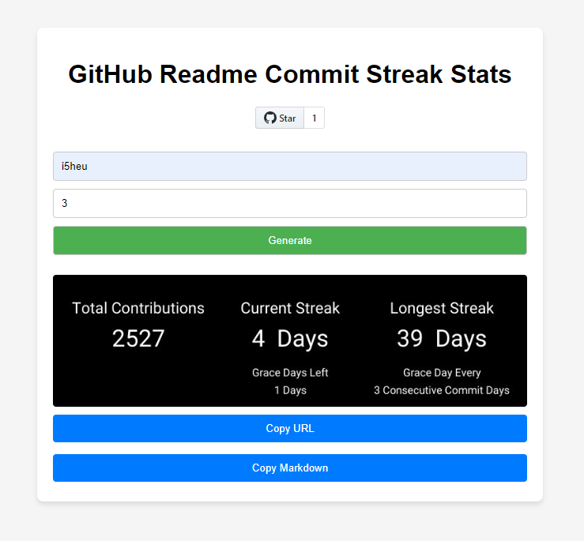

# github-readme-commit-streak-stats
Show the world your GitHub commit streak on your profile README!  

This tool allows you to use grace days after a configurable period of consecutive days with commits.

It is fast, reliable and easy to use.

Demo at https://commit-streak.heidenstedt.org


##  Environment Variables
```env
GITHUB_TOKEN=xxxxxxxxxxxxxxxxxxxxxxxxxxxxxxxxxxxxxxxx
```

## Example

<p align="center">
  
</p>

## Screenshot UI

<p align="center">
  <a href="https://commit-streak.heidenstedt.org">
    
  </a>
</p>